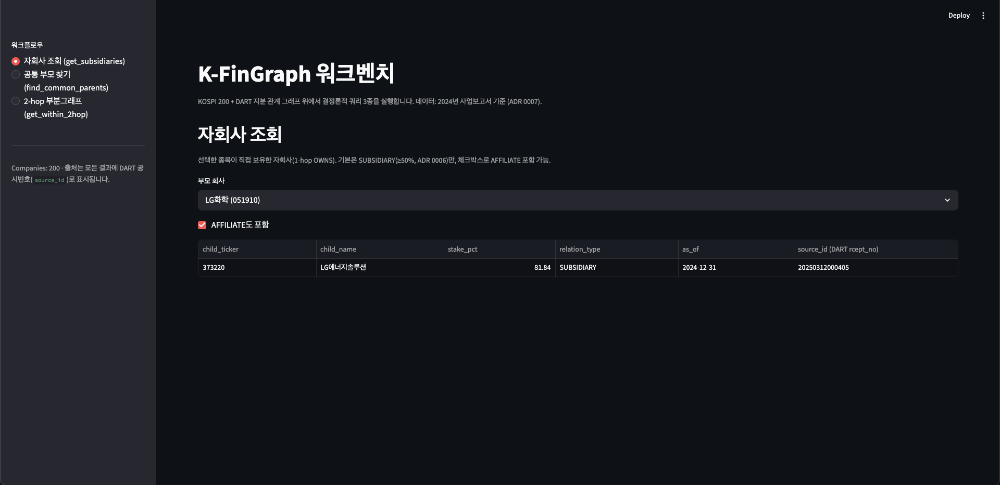
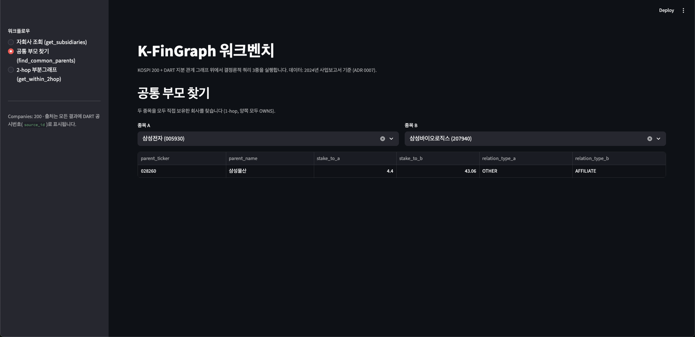
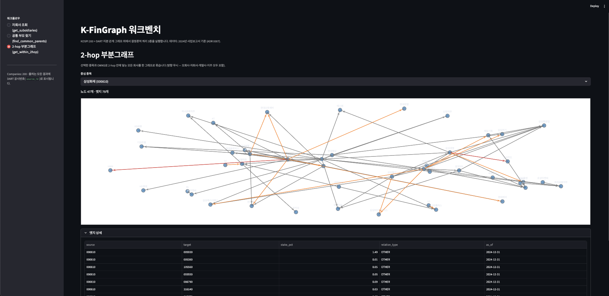

# K-FinGraph

한국 금융 시장의 기업·인물·이벤트·관계를 지식 그래프로 구조화하고,
세 가지 분석 워크플로우를 그래프 알고리즘으로 결정론적으로 수행하는
금융 분석 인프라.

LLM과 경쟁하지 않는다. LLM이 한국 금융 질문에 답할 때 호출하는
신뢰 가능한 정량 레이어가 되는 것이 목표다.

## 무엇을 하는가

세 가지 도구를 제공한다 (Layer 2 — 실제 product):

| 도구 | 설명 |
|---|---|
| `simulate_shock(entity, scenario)` | 충격 전파 시뮬레이션 |
| `find_similar_stocks(ticker, top_k, similarity_type)` | 유사 종목 발굴 |
| `analyze_portfolio_risk(tickers, scenario)` | 포트폴리오 리스크 분석 |

이 도구들은 **GraphRAG 패턴** 위에서 동작한다. LLM은 비정형 텍스트(DART
공시, 뉴스)에서 그래프를 구축하는 indexing 단계에만 사용하고, 실제
분석(retrieval)은 Cypher / GDS 알고리즘으로 결정론적으로 수행한다.
자연어 답변 layer는 호출자 LLM(Claude / ChatGPT 등)이 우리 MCP 도구를
호출하는 방식으로 위임한다. 자세한 포지셔닝:
[ADR 0004](docs/decisions/0004-graphrag-positioning.md).

## 현재 상태

**v0.5 완료** — 적재 universe를 KOSPI 보통주 + KOSDAQ 보통주 전종목으로
확장. KOSPI 200 데모 위에 회사 13배·OWNS 엣지 10배 규모로 그래프 확장.

- ✅ 회사 노드 **2,659개** (KOSPI 보통주 839 + KOSDAQ 보통주 1,820), DART
  corp_code 매칭률 100%
- ✅ DART 사업보고서 기반 OWNS 엣지 **2,347건** (양방향 — 타법인 출자 +
  최대주주 — Pydantic 검증·MERGE 중복 제거)
- ✅ 매칭 실패 (A) 분류 카운트 v0 baseline 338 → **181 (-46%)**. 잔여 분석은
  [ADR 0009](docs/decisions/0009-v05-owns-loading-scope.md)
- ✅ 그래프 읽기 쿼리 3종 (`get_subsidiaries`, `find_common_parents`,
  `get_within_2hop`) + Streamlit 워크벤치 — v0.5 universe에서도 동일 동작
- ✅ 모든 결과에 출처(DART 공시번호 `source_id`) 동반
- ✅ pytest -m "not e2e" 157 통과, ruff·mypy 0 error
- 🔜 v1 — 뉴스 RSS 기반 LLM NER/RE 파이프라인 (또는 v2 ER 우선 진입 — 결정 대기)

이후 로드맵(v1~v7): [tasks/backlog.md](tasks/backlog.md). 현재 스프린트
세부: [tasks/current.md](tasks/current.md).

## v0 데모

워크벤치 실행:

```bash
uv run streamlit run src/k_fingraph/interfaces/streamlit_app.py
```

### 자회사 조회 — 직접 보유 1-hop

선택한 종목이 직접 보유한 자회사. 기본은 SUBSIDIARY(≥50%, [ADR 0006](docs/decisions/0006-owns-relation-type-thresholds.md))만,
체크박스로 AFFILIATE(20% 이상)도 포함 가능.



> LG화학(051910)이 보유한 SUBSIDIARY 자회사: LG에너지솔루션 81.84%.

### 공통 부모 찾기 — 두 종목을 동시에 직접 보유한 회사



> 삼성전자(005930)와 삼성바이오로직스(207940)를 모두 직접 보유한 회사 = 삼성물산.

### 2-hop 부분그래프 — 시각화

선택한 종목과 OWNS로 2-hop 안에 닿는 모든 회사. 방향 무시(모회사·자회사·계열사
모두 포함). center 노드는 gold, relation_type별 색상 구분.



> 삼성화재해상보험(000810)을 중심으로 2-hop 안의 47개 회사 / 79개 관계.

## 아키텍처

```
Layer 3: Interfaces       Streamlit / MCP / FastAPI
Layer 2: Workflow Engine  3개 도구 (GraphRAG retrieval)
Layer 1: Graph Infra      Neo4j  +  LLM 추출 (GraphRAG indexing)  +  Entity Resolution
                            ↑ DART OpenAPI / 뉴스 RSS
```

자세한 데이터 흐름·모듈 경계·설계 원칙: [docs/architecture.md](docs/architecture.md).

## Quick Start

### Prerequisites
- Python 3.12
- [uv](https://docs.astral.sh/uv/) (`curl -LsSf https://astral.sh/uv/install.sh | sh`)
- Neo4j Aura Free 인스턴스, DART OpenAPI key, OpenAI API key
  — 발급 가이드는 [docs/setup.md](docs/setup.md)

### Install & Test

```bash
uv sync
cp .env.example .env   # 그다음 .env에 실제 키 채우기 (docs/setup.md 참조)

uv run ruff check .
uv run mypy src/
uv run pytest -x -m "not e2e"
```

E2E 테스트(실제 외부 API 호출, 비용 발생)는 별도:

```bash
uv run pytest -m e2e
```

## 프로젝트 구조

```
k-fingraph/
├── src/k_fingraph/
│   ├── config.py           환경변수 로딩 (Settings)
│   ├── errors.py           도메인 예외 (DartAPIError / DartParseError / LLMExtractionError / GraphWriteError)
│   ├── sources/            외부 데이터 fetch — DART 기업 식별자·정기보고서, KOSPI 200 매퍼, KOSPI+KOSDAQ 확장 universe 매퍼 (v0.5)
│   ├── extract/            정형 응답 → 그래프 후보 추출 (v0: DART 정형 JSON / v1+ LLM NER/RE) + 매칭 실패 진단 분류기
│   ├── resolve/            Entity Resolution — v0 단순 이름 매칭 (ADR 0008) / v2+ 임베딩 기반
│   ├── graph/              Neo4j client + 스키마 마이그레이션 + 멱등 적재 (Cypher/GDS 래퍼는 v3~)
│   ├── scripts/            CLI 진입점 (`load_v05` — 현행 적재; `load_v0` — v0 시점 frozen artifact)
│   ├── workflows/          Layer 2 — 3개 도구 구현                  · 예정 (v3~v5)
│   ├── interfaces/         Streamlit 워크벤치 (v0) — MCP / REST는 v6
│   └── schemas/            Pydantic models — 그래프 노드/엣지 + DART·KOSPI 200·확장 universe 응답 스키마
├── tests/
│   ├── unit/               외부 의존성 mock
│   ├── integration/        testcontainers Neo4j (Docker 미가동 시 자동 skip)
│   ├── e2e/                실제 외부 API 호출 (DART 엔드포인트 검증)
│   └── fixtures/           record-replay 데이터
├── data/
│   ├── raw/                외부 다운로드 원본 (gitignored)
│   └── reference/          정제된 참조 데이터 (KOSPI 200 / KOSPI·KOSDAQ 보통주 전종목)
├── docs/                   설계 문서
│   └── decisions/          ADR (변경 시 새 ADR 필수)
└── tasks/                  스프린트 관리 (current / backlog / done)
```

> "예정" 표시는 모듈 폴더와 빈 `__init__.py`만 있는 상태. v0 진행에 따라 채워진다.

## 문서

| 문서 | 내용 |
|---|---|
| [CLAUDE.md](CLAUDE.md) | 프로젝트 헌법 — Non-Negotiables, Anti-Patterns, Handoff Protocol |
| [docs/setup.md](docs/setup.md) | 처음 셋업 (외부 키 발급, `.env`, 첫 실행) |
| [docs/architecture.md](docs/architecture.md) | 3-layer 시스템 구조와 데이터 흐름 |
| [docs/schema.md](docs/schema.md) | 그래프 스키마 (살아있는 문서) |
| [docs/conventions.md](docs/conventions.md) | 코드 스타일·네이밍·테스트 정책 |
| [docs/testing.md](docs/testing.md) | 테스트 전략 (unit / integration / e2e) |
| [docs/progress.md](docs/progress.md) | 시간순 작업 로그 |
| [docs/data-notes.md](docs/data-notes.md) | DART API 도메인 학습 노트 + 미래 도구 sprint별 추가 학습 필요 API 카탈로그 |
| [docs/troubleshooting.md](docs/troubleshooting.md) | 마주친 문제와 해결 기록 |
| [docs/decisions/README.md](docs/decisions/README.md) | ADR 인덱스 (제목·Status·재검토 트리거). 개별 ADR은 인덱스에서 진입 |

## 기술 스택

- **Python 3.12**, **uv** ([ADR 0001](docs/decisions/0001-package-manager-uv.md))
- **Pydantic** v2 + **pydantic-settings** (스키마·환경변수)
- **ruff** + **mypy (strict)** + **pytest** (피드백 루프)
- **Neo4j** — Aura Free → Docker 단계적 전환 ([ADR 0002](docs/decisions/0002-neo4j-aura-then-docker.md)). Python 공식 `neo4j` 드라이버 사용
- **testcontainers[neo4j]** — 통합 테스트용 일회성 Neo4j 컨테이너
- **OpenAI GPT-4o-mini** — LLM 추출 ([ADR 0003](docs/decisions/0003-llm-extraction-gpt4o-mini.md))
- **httpx** — DART OpenAPI 호출
- **Streamlit** + **Plotly** + **networkx** — v0 워크벤치 (시각화 라이브러리는
  v3 인터랙션 요구가 분명해질 때 정식 ADR로 재선택 — 트리거는 backlog v3 섹션)
- (예정) **MCP**, **Neo4j GDS**, **Node2Vec**
